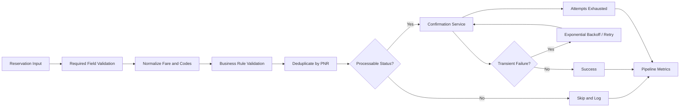

# Automation Architecture

## Workflow

## Design Decisions

**Validation before automation:** malformed records are rejected before downstream processing.

**Permanent vs. transient errors:** input-validation failures fail fast, while simulated temporary service failures are eligible for bounded retries.

**Idempotency-oriented duplicate handling:** PNR is used as the reservation identity for duplicate suppression.

**Observability:** logging and summary counters expose what the bot processed, skipped, retried, and failed.

**Reproducibility:** seeded synthetic data and deterministic unit tests make failures easier to reproduce.

## Production Extension Points

A production implementation could replace the simulated confirmation service with an approved airline or travel-platform API, persist run metrics to a monitoring platform, protect credentials in a secrets manager, and introduce a durable work queue for high-volume processing.
